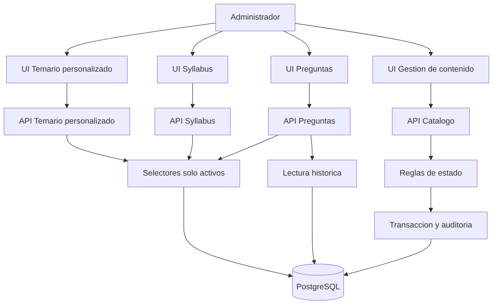

# Solution Design: Estado Activo/Inactivo de Temas y Subtemas del Temario General

## 1. Architecture Overview

### 1.1 High-Level Diagram



### 1.2 Architecture Decision Summary

| Decision | Opcion elegida | Rationale |
|---|---|---|
| Estado operativo | Agregar un estado de negocio `Activo/Inactivo` independiente de `fl_status` y `deleted_at` | El codigo actual usa `fl_status` como borrado/vida tecnica. Usarlo para inactivar contenido romperia historicos. |
| Valor por defecto | Todo tema/subtema nuevo nace `Activo` | Mantiene el comportamiento actual y evita bloquear contenido existente. |
| Desactivar tema | Desactiva automaticamente todos sus subtemas | Es una regla explicita de US-1. |
| Reactivar tema | No reactiva subtemas automaticamente | La especificacion no lo pide y reactivar hijos sin revision puede habilitar contenido obsoleto. |
| Nuevas selecciones | Temario personalizado, syllabus e indexacion solo muestran activos | Evita usar contenido obsoleto en nuevos procesos. |
| Historicos | Preguntas, syllabus y temarios existentes conservan relaciones aunque el item este inactivo | Cumple US-4 sin perdida de trazabilidad. |
| Confirmacion | La UI muestra impacto antes de ejecutar el cambio | Cumple US-5 y reduce errores administrativos. |
| Validacion final | Backend rechaza IDs inactivos aunque la UI no los muestre | La seguridad de la regla no depende del frontend. |

## 2. Component Design

### 2.1 Catalog Status Rules

Responsabilidad:
Definir estados validos, cambios permitidos y reglas padre-hijo.

Interfaces:
- Entrada: id del tema/subtema, estado destino, usuario que ejecuta.
- Salida: registro actualizado, estado final, elementos afectados.

Dependencias:
Catalogo de temas/subtemas, usuario autenticado, transaccion y auditoria.

Traces to: US-1, US-5.

### 2.2 Topic Status Update

Responsabilidad:
Cambiar estado de un tema. Si pasa a `Inactivo`, todos sus subtemas pasan a `Inactivo` en la misma operacion.

Interfaces:
- Request: `topic_id`, `status`.
- Response: tema actualizado y subtemas afectados.

Dependencias:
Reglas de estado, persistencia de temas/subtemas, auditoria.

Traces to: US-1, US-5.

### 2.3 Subtopic Status Update

Responsabilidad:
Cambiar estado de un subtema. No permite activar un subtema si su tema padre sigue inactivo.

Interfaces:
- Request: `subtopic_id`, `status`.
- Response: subtema actualizado.

Dependencias:
Reglas de estado, persistencia de temas/subtemas, auditoria.

Traces to: US-1, US-5.

### 2.4 Impact Preview

Responsabilidad:
Calcular que pasara antes de confirmar un cambio de estado.

Debe informar:
- Cuantos subtemas se desactivaran.
- Si existen temarios personalizados que referencian el item.
- Si existen syllabus que referencian el item.
- Si existen preguntas indexadas asociadas.

Traces to: US-5, US-4.

### 2.5 Catalog API

Responsabilidad:
Exponer operaciones para listar, filtrar y cambiar estado de temas/subtemas.

Debe cubrir:
- Listar temas con filtro `Activo`, `Inactivo` o todos.
- Listar subtemas con filtro `Activo`, `Inactivo` o todos.
- Consultar impacto antes del cambio.
- Actualizar estado.

Traces to: US-1, US-2, US-3, US-5.

### 2.6 Active Selectors

Responsabilidad:
Centralizar las consultas usadas para nuevas selecciones academicas.

Debe aplicar filtro activo por defecto en:
- Temario personalizado.
- Creacion de syllabus.
- Indexacion de preguntas.
- Edicion de atributos de preguntas.

Traces to: US-2, US-3.

### 2.7 Historical Read Model

Responsabilidad:
Permitir ver relaciones antiguas aunque el tema/subtema ahora este inactivo.

Debe devolver:
- Nombre del tema/subtema.
- Estado actual.
- Marca visual para renderizarlo en gris.

No debe modificar:
- Preguntas ya indexadas.
- Relaciones pregunta-subtema.
- Syllabus ya creados.
- Temarios personalizados existentes.

Traces to: US-4.

### 2.8 Frontend Content Management

Responsabilidad:
Mostrar y cambiar estado desde la administracion de contenido.

Debe incluir:
- Indicador `Activo/Inactivo`.
- Filtro por estado.
- Accion de activar/desactivar.
- Modal de advertencia.
- Refresco de datos despues del cambio.

Traces to: US-1, US-5.

### 2.9 Frontend Operational Flows

Responsabilidad:
Asegurar que las pantallas operativas no permitan nuevas selecciones inactivas.

Debe cubrir:
- Temario personalizado: ocultar temas/subtemas inactivos.
- Syllabus: ocultar temas/subtemas inactivos.
- Indexacion de preguntas: ocultar temas/subtemas inactivos.
- Edicion de atributos: ocultar inactivos para nuevas selecciones.

Traces to: US-2, US-3.

### 2.10 Frontend Historical Display

Responsabilidad:
Mostrar historicos inactivos sin permitir que se seleccionen como nuevos.

Debe incluir:
- Texto o chip gris `Inactivo`.
- Modo no seleccionable cuando el item ya no esta vigente.
- Mensaje claro si el usuario intenta guardar un item que se inactivo durante la sesion.

Traces to: US-4.

## 3. Data Model

### 3.1 Tables In Scope

| Tabla | Uso actual | Cambio requerido |
|---|---|---|
| `topic` | Guarda temas del temario general | Agregar estado operativo. |
| `subtopic` | Guarda subtemas del temario general | Agregar estado operativo. |
| `question` | Guarda relacion historica con tema | No modificar relacion; solo enriquecer lectura. |
| `question_subtopic` | Guarda relacion historica con subtema | No modificar relacion; solo enriquecer lectura. |
| `syllabus_template_topic` | Temas en temarios personalizados/templates | Mantener historico; filtrar activos para nuevas selecciones. |
| `syllabus_template_topic_subtopic` | Subtemas en temarios personalizados/templates | Mantener historico; filtrar activos para nuevas selecciones. |
| `syllabus_topic` y `syllabus_detail_subtopic` | Configuracion de syllabus | Mantener historico; filtrar activos para nuevas selecciones. |

### 3.2 Proposed Fields

En `topic`:
- `availability_status`: `ACTIVE` o `INACTIVE`, default `ACTIVE`.
- `availability_changed_by`: usuario que hizo el ultimo cambio.
- `availability_changed_at`: fecha del ultimo cambio.

En `subtopic`:
- `availability_status`: `ACTIVE` o `INACTIVE`, default `ACTIVE`.
- `availability_changed_by`: usuario que hizo el ultimo cambio.
- `availability_changed_at`: fecha del ultimo cambio.

Historial de cambios:
- Tipo de item: tema o subtema.
- Id del item.
- Estado anterior.
- Estado nuevo.
- Usuario.
- Fecha.
- Cantidad de hijos afectados cuando aplique.

### 3.3 Rules

- Solo se aceptan `ACTIVE` e `INACTIVE`.
- Un subtema no puede estar activo si su tema padre esta inactivo.
- Desactivar un tema desactiva sus subtemas.
- Reactivar un tema no reactiva sus subtemas.
- Cambiar estado no debe borrar ni modificar preguntas ya indexadas.

## 4. API Design

No se agrega contrato separado. La implementacion debe mantener el formato actual de Odiseo:

```json
{
  "success": true,
  "type": "success",
  "message": "Estado actualizado correctamente.",
  "data": {}
}
```

### 4.1 Required Endpoints

| Operacion | Request | Response | Traces to |
|---|---|---|---|
| Listar temas | filtros: curso, texto, estado | temas con estado | US-1 |
| Listar subtemas | filtros: curso, tema, texto, estado | subtemas con estado | US-1 |
| Impacto de tema | tema + estado destino | conteos de impacto | US-5 |
| Impacto de subtema | subtema + estado destino | conteos de impacto | US-5 |
| Cambiar estado de tema | tema + estado destino | tema actualizado + subtemas afectados | US-1, US-5 |
| Cambiar estado de subtema | subtema + estado destino | subtema actualizado | US-1, US-5 |

### 4.2 Existing APIs To Adjust

| Flujo | Cambio requerido | Traces to |
|---|---|---|
| Temario personalizado | Listar solo activos y rechazar guardado con inactivos | US-2 |
| Syllabus | Listar solo activos para nueva configuracion | US-3 |
| Indexacion de preguntas | Listar solo activos para nueva indexacion | US-3 |
| Edicion de atributos | Listar solo activos para nuevas selecciones | US-3 |
| Detalle de pregunta | Incluir estado actual para mostrar historicos en gris | US-4 |
| Reportes | Mantener nombres historicos aunque el item este inactivo | US-4 |

### 4.3 Error Responses

| Caso | Codigo esperado |
|---|---|
| No autenticado | 401 |
| Sin permisos | 403 |
| Tema/subtema no existe | 404 |
| Estado invalido | 422 |
| Activar subtema con tema padre inactivo | 409 |
| Usar item inactivo en una nueva seleccion | 422 o 409 |

## 5. Security Considerations

### Autenticacion

Todas las operaciones deben requerir usuario autenticado.

### Autorizacion

- Cambiar estado de tema requiere permiso de actualizar tema.
- Cambiar estado de subtema requiere permiso de actualizar subtema.
- La UI puede ocultar botones, pero el backend siempre valida permisos.

### Proteccion de Datos

- No se borran relaciones historicas.
- El modal de impacto muestra conteos, no contenido completo de preguntas.
- La auditoria registra usuario, fecha, estado anterior y estado nuevo.

### Amenazas

| Amenaza | Mitigacion |
|---|---|
| Usuario fuerza un ID inactivo desde el navegador | Validacion backend antes de guardar. |
| Usuario sin permisos cambia estado | Middleware de permisos. |
| Estado invalido en payload | Validacion enum. |
| Dos administradores cambian el mismo item | Validar estado actual antes de escribir y responder conflicto si cambio. |

## 6. Performance Considerations

### Thresholds

| Operacion | Objetivo |
|---|---|
| Listar temas/subtemas con filtro | Menor a 500 ms en uso normal. |
| Selectores operativos | Menor a 300 ms en uso normal. |
| Calcular impacto | Menor a 800 ms en uso normal. |
| Desactivar tema con muchos subtemas | Escritura en lote y sin timeout. |

### Estrategias

- Filtrar activos en base de datos, no en frontend.
- Agregar indices por curso, tema y estado.
- Actualizar subtemas en lote al desactivar un tema.
- Calcular impacto con conteos agregados.
- No recargar toda la pagina despues de cambiar estado.

## 7. Integration Points

| Integracion | Como se conecta | Traces to |
|---|---|---|
| Administracion de contenido | Muestra y cambia estado de temas/subtemas | US-1, US-5 |
| Temario personalizado | Usa solo activos para nuevas configuraciones | US-2 |
| Syllabus | Usa solo activos para nuevas configuraciones | US-3 |
| Indexacion de preguntas | Usa solo activos para nuevas indexaciones | US-3 |
| Edicion de atributos | Usa solo activos para nuevas selecciones | US-3 |
| Preguntas historicas | Muestra inactivos en gris sin modificar relaciones | US-4 |
| Reportes | Conserva nombres historicos | US-4 |
| Auditoria | Registra cada cambio de estado | NFR-2 |

### 7.1 Backend Impact Map

| Archivo / funcion | Cambio requerido | Traces to |
|---|---|---|
| `routes/settings/topic/RouteTopic.php` | Agregar rutas de impacto/cambio de estado y aceptar filtro de estado en listados. | US-1, US-5 |
| `routes/settings/subtopic/RouteSubTopic.php` | Agregar rutas de impacto/cambio de estado y aceptar filtro de estado en listados. | US-1, US-5 |
| `routes/settings/management/RouteManagement.php` | Exponer estado en `management/topics` y `management/subtopics` usados por gestion de contenido. | US-1 |
| `app/Http/Controllers/V1/Settings/Topic/TopicController.php` | Extender `get`, `getAll`, `getAllManagement`, `updateTopic`; agregar metodos de impacto y estado. | US-1, US-5 |
| `app/Service/Settings/Topic/TopicService.php` | Orquestar cambio de estado, cascada a subtemas e impacto. | US-1, US-5 |
| `app/Repository/Settings/Topics/TopicRepositoryPostgreSQL.php` | Filtrar por estado, actualizar estado, calcular impacto y validar temas activos. | US-1, US-2, US-3 |
| `app/Http/Controllers/V1/Settings/SubTopic/SubTopicController.php` | Extender `get`, `getAll`, `getAllManagement`, `updateSubTopic`; agregar metodos de impacto y estado. | US-1, US-5 |
| `app/Service/Settings/SubTopic/SubTopicService.php` | Orquestar cambio de estado y validar que no se active bajo tema inactivo. | US-1 |
| `app/Repository/Settings/SubTopic/SubTopicRepositoryPostgreSQL.php` | Filtrar por estado, actualizar estado, calcular impacto y validar subtemas activos. | US-1, US-2, US-3 |
| `src/App/Modules/V2/Catalog/Topic/**` | Propagar `availability_status` en DTOs, validators, use cases, responses y queries V2. | US-1, US-3 |
| `src/App/Modules/V2/Catalog/Subtopic/**` | Propagar `availability_status` en DTOs, validators, use cases, responses y queries V2. | US-1, US-3 |
| `database/migrations/functions/fn_search_topic` y `fn_search_subtopic` | Devolver y filtrar estado en grillas administrativas. | US-1 |
| `app/Repository/Settings/TemplateSyllabus/TemplateSyllabusRepositoryPostgreSQL.php` | Ajustar `getTopics`, `getSubTopics`, `saveTopicsTemplateSyllabus`, `saveSubTopicsTemplateSyllabus`. | US-2 |
| `database/migrations/functions/fn_list_topics_by_universities_and_course_or_pseudo` y `fn_list_subtopics_by_universities_and_topic_and_course` | Excluir inactivos en temario personalizado. | US-2 |
| `app/Repository/Settings/Syllabus/SyllabusRepositoryPostgreSQL.php` | Ajustar `syllabusTemplateTopics`, `syllabusTemplateSubtopics`, `saveSyllabus`, `editSyllabus`. | US-3, US-4 |
| `database/migrations/functions/fn_get_syllabus_template_topics`, `fn_get_syllabus_template_subtopics`, `fn_save_syllabus`, `fn_edit_syllabus` | Excluir inactivos en nuevas selecciones y conservar historicos. | US-3, US-4 |
| `app/Http/Controllers/V1/Bank/QuestionTeacher/QuestionTeacherController.php` y `app/Repository/QuestionTeacher/*` | Filtrar temas/subtemas activos para indexacion. | US-3 |
| `app/Service/Question/**` y `app/Repository/Question/**` | Rechazar IDs inactivos al indexar/editar y devolver estado para vista historica. | US-3, US-4 |

### 7.2 Frontend Impact Map

| Archivo / funcion | Cambio requerido | Traces to |
|---|---|---|
| `src/modules/content-config/services/content.service.js` | Agregar filtro `status`, llamadas de impacto y cambio de estado. | US-1, US-5 |
| `src/modules/content-config/pages/ContentConfig.page.vue` | Mostrar estado, filtro, modal de advertencia y refresco de listas. | US-1, US-5 |
| `src/components/odiseo/configuracion/banco/temas/TemasAddEditDialog.vue` | Incluir control/visualizacion de estado de tema. | US-1 |
| `src/components/odiseo/configuracion/banco/subtemas/SubtemasAddEditDialog.vue` | Incluir control/visualizacion de estado de subtema. | US-1 |
| `src/modules/personalized-syllabus/services/personalized-syllabus.service.ts` | Filtrar activos en `getTopicsByUniversityIdForTemplateSyllabus` y `getSubtopicsByUniversityIdForTemplateSyllabus`. | US-2 |
| `src/modules/personalized-syllabus/services/temario-universidad.service.js` | Filtrar activos en topics/subtopics usados por creacion de temario. | US-2 |
| `src/modules/personalized-syllabus/dialogs/*` y components de seleccion | Ocultar inactivos y mostrar historicos como no seleccionables. | US-2, US-4 |
| `src/modules/syllabus/services/syllabus.service.ts` | Filtrar activos en `getSyllabusTemplateTopics` y `getSyllabusTemplateSubTopics`. | US-3 |
| `src/modules/syllabus/components/InitialWeekSubtopicSelection.vue` y `SyllabusEditorQuestions.vue` | Evitar nuevas selecciones inactivas y renderizar historicos en gris. | US-3, US-4 |
| `src/modules/question-teacher-assigned/dialogs/IndexQuestionDialog.vue` | Usar solo activos al indexar preguntas. | US-3 |
| `src/components/odiseo/bank/EditAttributesDialog.vue` y `src/modules/shared/components/QuestionAttributesForm.vue` | Ocultar inactivos para nuevas selecciones y mostrar historicos en gris. | US-3, US-4 |
| Paginas que abren `EditAttributesDialog` en modulos de preguntas | Pasar/mostrar estado actual de tema/subtema en listados y dialogs. | US-4 |

## 8. Error Handling

| Error | Manejo |
|---|---|
| Falla al calcular impacto | No mostrar confirmacion; permitir reintentar. |
| Cancelacion del modal | No llamar API de cambio. |
| Cambio exitoso | Actualizar estado en UI y limpiar caches/listas afectadas. |
| Error de red | Mantener estado anterior y mostrar mensaje. |
| Item ya cambio por otro usuario | Refrescar datos y pedir nueva confirmacion. |
| Guardado con item inactivo | Bloquear guardado y mostrar que ya no esta disponible. |
| Fallo en cascada de subtemas | Rollback completo; no dejar cambios parciales. |

## 9. Risk Register

| Riesgo | Impacto | Mitigacion |
|---|---|---|
| Confundir estado operativo con `fl_status` | Alto | Usar campo independiente y documentar la diferencia. |
| Romper historicos por filtrar inactivos en todas las consultas | Alto | Separar consultas operativas de consultas historicas. |
| Olvidar algun selector operativo | Alto | Revisar temario personalizado, syllabus, indexacion y atributos. |
| La UI conserva opciones antiguas por cache | Medio | Invalidar listas despues del cambio y validar en backend. |
| Desactivar tema con muchos subtemas tarda demasiado | Medio | Usar update en lote e indices. |
| Modal de impacto consulta demasiados datos | Medio | Mostrar conteos, no listas completas. |
| Reportes muestran vacios para temas inactivos | Medio | Probar reportes y lecturas historicas. |
| Reactivacion de subtemas no definida por negocio | Medio | Mantener subtemas inactivos y documentar la decision. |

## Tasks

### T1. Alinear alcance

| Task | Description | Traces to |
|---|---|---|
| T1.1 | Confirmar que los estados son solo `Activo` e `Inactivo`. | US-1 |
| T1.2 | Confirmar que reactivar tema no reactiva subtemas automaticamente. | US-1 |
| T1.3 | Identificar todos los selectores actuales de temas/subtemas en frontend y backend. | US-2, US-3 |

### T2. Persistencia

| Task | Description | Traces to |
|---|---|---|
| T2.1 | Agregar estado operativo a temas y subtemas con default activo. | US-1 |
| T2.2 | Crear historial/auditoria de cambios de estado. | NFR-2 |
| T2.3 | Agregar validacion para impedir subtema activo bajo tema inactivo. | US-1 |
| T2.4 | Agregar indices necesarios para filtros por estado. | NFR-1 |

### T3. Backend catalogo

| Task | Description | Traces to |
|---|---|---|
| T3.1 | Implementar cambio de estado de tema con cascada a subtemas. | US-1 |
| T3.2 | Implementar cambio de estado de subtema. | US-1 |
| T3.3 | Implementar consulta de impacto para tema/subtema. | US-5 |
| T3.4 | Agregar filtro por estado en listados administrativos. | US-1 |
| T3.5 | Registrar auditoria en cada cambio exitoso. | NFR-2 |

### T4. Backend flujos operativos

| Task | Description | Traces to |
|---|---|---|
| T4.1 | Temario personalizado: excluir inactivos en listas y validar guardado. | US-2 |
| T4.2 | Syllabus: excluir inactivos en seleccion de temas/subtemas. | US-3 |
| T4.3 | Indexacion: excluir inactivos en seleccion de tema/subtema. | US-3 |
| T4.4 | Edicion de atributos: excluir inactivos en nuevas selecciones. | US-3 |
| T4.5 | Detalle de preguntas: devolver estado para mostrar historicos en gris. | US-4 |
| T4.6 | Reportes: conservar nombres y relaciones historicas. | US-4 |

### T5. Frontend administracion

| Task | Description | Traces to |
|---|---|---|
| T5.1 | Mostrar estado actual de temas y subtemas. | US-1 |
| T5.2 | Agregar filtro por estado. | US-1 |
| T5.3 | Agregar modal de advertencia con impacto. | US-5 |
| T5.4 | Ejecutar cambio solo al confirmar. | US-5 |
| T5.5 | Cancelar sin cambios si el usuario cierra o cancela el modal. | US-5 |

### T6. Frontend flujos academicos

| Task | Description | Traces to |
|---|---|---|
| T6.1 | Temario personalizado: ocultar inactivos en nuevas selecciones. | US-2 |
| T6.2 | Syllabus: ocultar inactivos en nuevas selecciones. | US-3 |
| T6.3 | Indexacion: ocultar inactivos en tema/subtema. | US-3 |
| T6.4 | Atributos de pregunta: ocultar inactivos para nuevas selecciones. | US-3 |
| T6.5 | Historicos: mostrar inactivos en gris sin borrar seleccion previa. | US-4 |

### T7. Pruebas y Gate 2

| Task | Description | Traces to |
|---|---|---|
| T7.1 | Probar estados validos e invalidos. | US-1 |
| T7.2 | Probar cascada al desactivar tema. | US-1 |
| T7.3 | Probar que temario personalizado, syllabus e indexacion no muestran inactivos. | US-2, US-3 |
| T7.4 | Probar que preguntas historicas conservan tema/subtema y lo muestran en gris. | US-4 |
| T7.5 | Probar modal confirmar/cancelar. | US-5 |
| T7.6 | Validar que cada US tiene al menos un componente y tareas asociadas. | US-1, US-2, US-3, US-4, US-5 |
